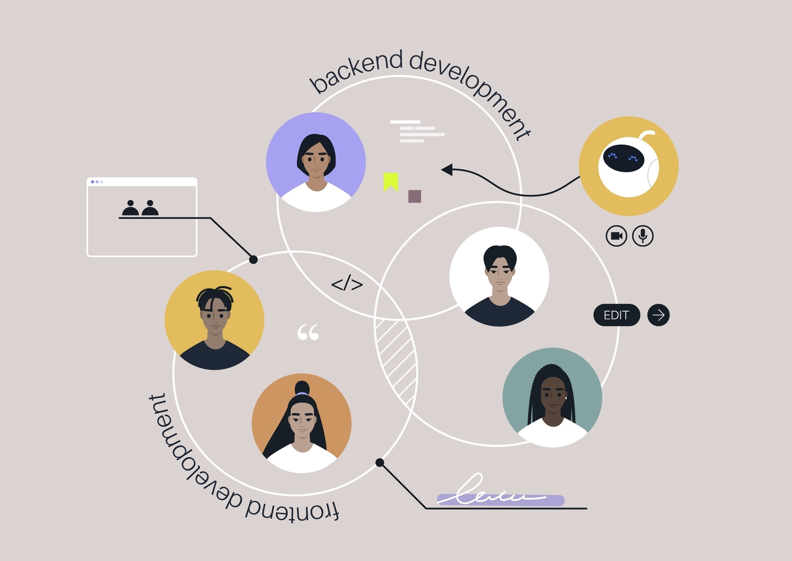

# 📖 Guia de Inicialização: Projeto WAVR (Frontend)

1. Pré-requisitosAntes de rodar os comandos, você precisa instalar:Node.js (versão LTS): Baixe em nodejs.org.VS Code: O editor de código mais usado.

2. Comandos Principais (Terminal)Abra o terminal na pasta onde deseja salvar o projeto e execute:Bash

## 1. Criar o projeto Next.js (responda 'Yes' para tudo, especialmente Tailwind e App Router)

- npx create-next-app@latest wavr-frontend

## 2. Entrar na pasta do projeto

- cd wavr-frontend

## 3. Instalar bibliotecas de animação e ícones

- npm install framer-motion lucide-react axios

## 4. Instalar componentes de UI (opcional, mas recomendado)

- npx shadcn-ui@latest init

## 5. Rodar o projeto em modo de desenvolvimento

- npm run dev

Após o comando npm run dev, abra seu navegador em <http://localhost:3000>.

1. Estrutura de Pastas (Visão Geral)Para um iniciante, a estrutura do Next.js 14/15 pode parecer confusa. Foque na pasta
src/app:

Plaintextwavr-frontend/
├── public/              # Imagens e fontes públicas
├── src/
│   ├── app/             # Onde a mágica acontece (Roteamento)
│   │   ├── layout.tsx   # Design que se repete em todas as telas (Sidebar/Player)
│   │   ├── page.tsx     # A Home (Dashboard)
│   │   ├── login/       # Pasta da tela de login
│   │   │   └── page.tsx # Arquivo da tela de login
│   │   └── globals.css  # Onde o Tailwind vive
│   ├── components/      # Pedacinhos de código (Botão, Card, etc.)
│   ├── contexts/        # Lógica de login (AuthContext)
│   └── services/        # Conexão com o Backend Java (api.ts)
├── tailwind.config.ts   # Cores e temas (Apple/Spotify)
└── package.json         # Lista de "ingredientes" do projeto

4 - Como funciona a comunicação (Frontend ↔ Backend)

- Imagine que o seu Backend (Java) é a cozinha de um restaurante e o seu Frontend (Next.js) é o garçom.Request (Pedido): Quando você clica em "Converter", o garçom (Next.js) leva a URL do YouTube até a cozinha (Java).
- Processing (Cozinhando): O Java processa o MP3.
- Response (Entrega): O Java devolve o arquivo ou o status de sucesso para o garçom, que mostra na tela para você.
  

- Shutterstock5. Dicas para Iniciantes'use client': No topo de arquivos que têm botões ou animações (como os que te passei), você precisa escrever 'use client';. Isso avisa ao Next.js que aquele código roda no navegador do usuário.
- CamelCase: Em React, usamos className em vez de class e escrevemos funções começando com letra maiúscula (ex: function CardMusica()).
- Erros no Terminal: Se o terminal ficar vermelho, não entre em pânico! Geralmente é falta de alguma vírgula ou uma biblioteca que não foi instalada.
- 6 Documento de Referência Rápida
- Comando              O que faz?
- npm run dev          Liga o servidor para você ver o site.
- npm install <nome>   Adiciona uma ferramenta nova ao projeto.
- ctrl + c             Desliga o servidor no terminal.

## O que você fez aqui:
- Design System: Configurou o Tailwind para reconhecer as cores "Apple Dark" e o "Verde Neon".

- Login: Criou uma interface de impacto com animações e efeito de vidro.

- Dashboard: Construiu uma barra lateral fixa e uma área de conteúdo que rola, idêntica aos apps de música premium.

- Integração: Deixou o caminho pronto para enviar as URLs para o seu código Java processar.

## Próximo Passo Sugerido:
1 - Para ver o site funcionando, basta rodar o comando npm run dev no terminal do VS Code e acessar localhost:3000/login.
2 - Gostaria que eu detalhasse como criar o Cadastro de Conta ou como fazer o botão Converter chamar o Java de verdade?